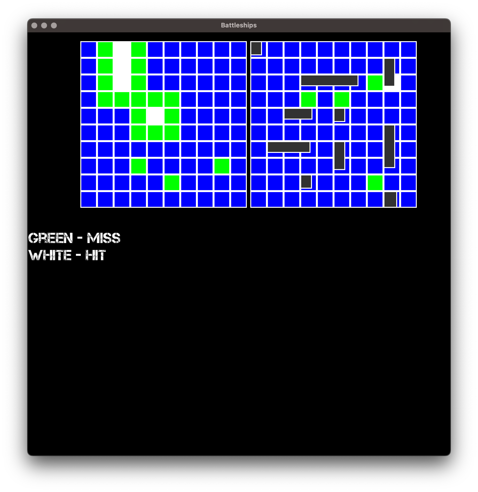

# Battleship

A classic turn-based Battleship game implemented in C++ with the SFML graphics library. Two players can face off on a single machine, strategically placing their fleets and firing upon each other's grids until one navy is completely destroyed.

 

## Features

*   **Two-Player Local Gameplay:** Perfect for head-to-head competition on one computer.
*   **Interactive Ship Placement:** Intuitive drag-and-drop or coordinate-based placement for setting up your fleet.
*   **Turn-Based Strategy:** Players take turns calling shots and tracking hits and misses.
*   **Visual Feedback:** Clear graphics show hits, misses, and sunk ships.
*   **Classic Rules:** Faithful to the traditional board game, with a standard fleet of ships.

## How to Play

1.  **Setup:** Each player places their five ships on their own grid. Ships can be placed horizontally or vertically without overlapping.
2.  **Combat:** Players take turns.
    *   On your turn, click on the opponent's grid to fire a shot at a coordinate.
    *   If you hit every segment of a ship, it is sunk.
3.  **Victory:** The first player to sink all of their opponent's ships wins the game!

## Compatibility

This project is currently configured for:
- **Platform:** macOS
- **Architecture:** ARM(Apple Silicon)
- **Compiler:** clang++ or g++
- **SFML Version:** 2.6.1
- 
## Getting Started

### Prerequisites

*   **C++ Compiler:** (e.g., g++, clang++)
*   **SFML Library:** Version 2.5.x or higher.

### Installation & Compilation

1.  **Clone the repository**
    ```bash
    git clone https://github.com/michael-399/Battleship-Game.git
    cd Battleship-Game
    ```

2.  **Compile the game**
    *   **Using the provided Makefile:**
        ```bash
        make
        ```
    *   **Manual compilation with clang++ (macOS):**
        ```bash
        clang++ -std=c++17 -Wall -I./SFML-2.6.1-macOS-clang-arm64/include -c main.cpp -o main.o
        clang++ main.o -o Battleship -L./SFML-2.6.1-macOS-clang-arm64/lib -lsfml-graphics -lsfml-window -lsfml-system -lsfml-audio -Wl,-rpath,@executable_path/SFML-2.6.1-macOS-clang-arm64/lib
        ```
    *   **Manual compilation with g++ (Linux):**
        ```bash
        g++ -std=c++17 -Wall -I./SFML-2.6.1-macOS-clang-arm64/include -c main.cpp -o main.o
        g++ main.o -o Battleship -L./SFML-2.6.1-macOS-clang-arm64/lib -lsfml-graphics -lsfml-window -lsfml-system -lsfml-audio -Wl,-rpath,@executable_path/SFML-2.6.1-macOS-clang-arm64/lib
        ```

3.  **Run the game**
    ```bash
    ./Battleship
    ```

## Controls

*   **Mouse:** Click to select coordinates for placing ships and firing shots.
*   **Keyboard:** R key to rotate ship during placement phase.
